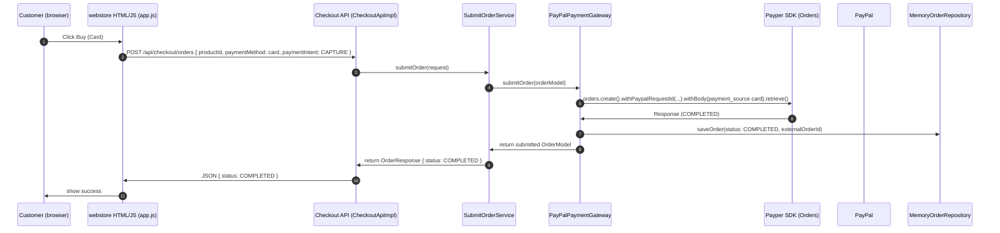
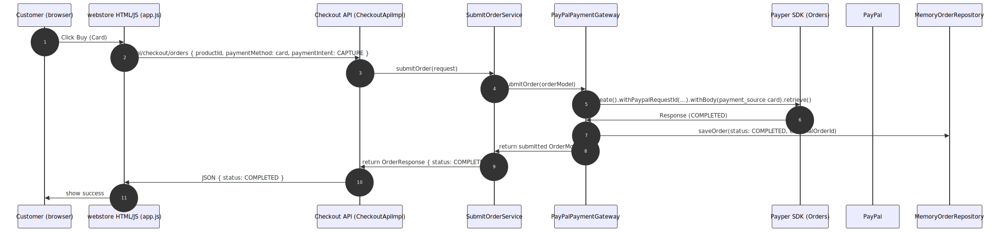
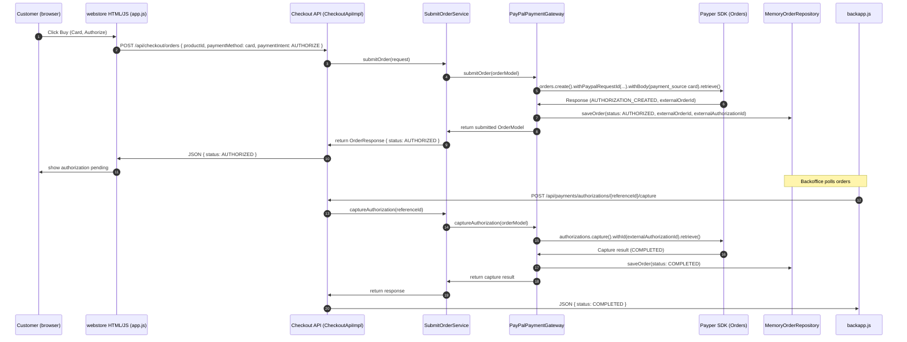
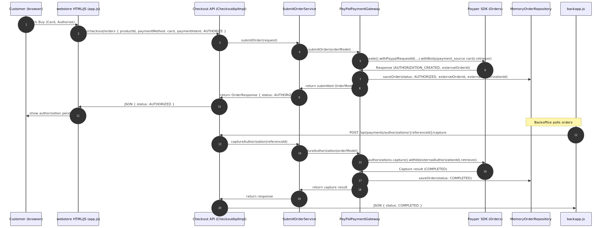
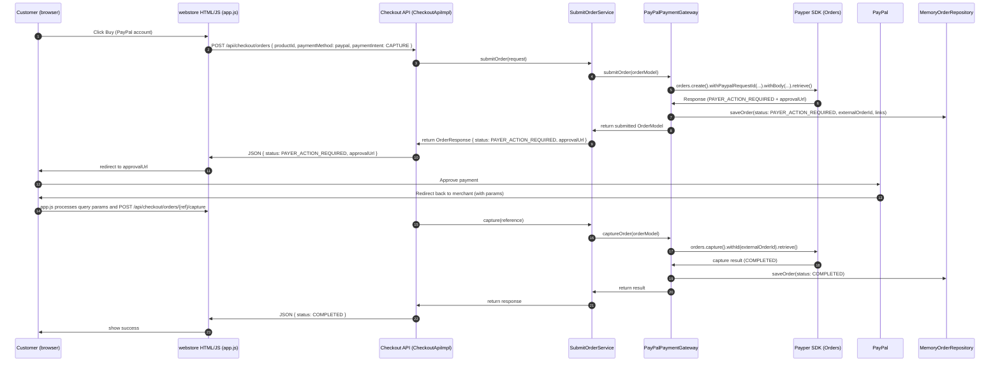
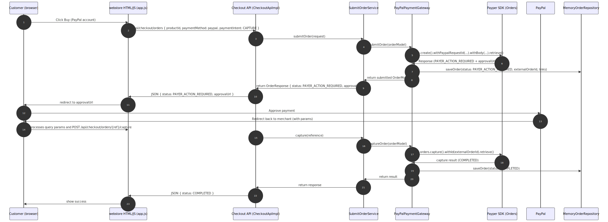
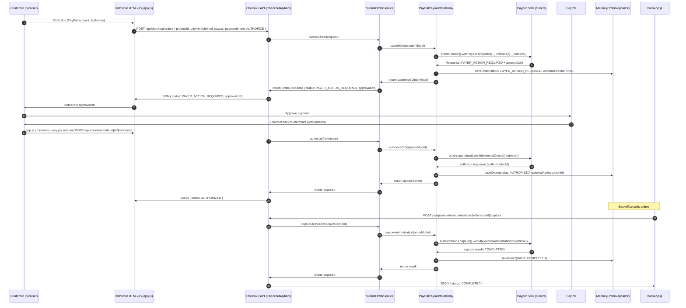
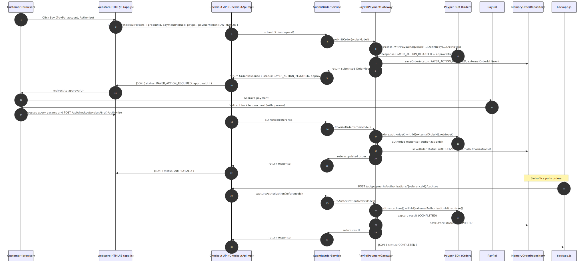

# Webstore Execution Flow — Payper SDK Example

A compact, developer-focused guide explaining the end-to-end runtime behavior of the Webstore demo: how the UI (`app.js` / `backapp.js`) maps to backend controllers, services, the `PayPalPaymentGateway` and the Payper SDK calls.

## Table of contents

- [Files referenced](#files-referenced)
- [High-level summary](#high-level-summary)
- [Two main checkout flows](#two-main-checkout-flows)
  - [PayPal account (redirect / approval)](#1-paypal-account-redirect--approval)
  - [Credit card (direct capture)](#2-credit-card-direct-capture)
- [Backoffice / capture of authorizations](#backoffice--capture-of-authorizations)
- [Mermaid sequence diagrams](#mermaid-sequence-diagrams-separated-by-case)

---

## Files referenced

- Frontend: `src/main/resources/static/app.js`, `src/main/resources/static/backapp.js`, `src/main/resources/static/webstore.html`, `src/main/resources/static/backoffice.html`
- Backend controllers: `io.github.eealba.example.webstore.infrastructure.web.CheckoutApiImpl`, `PaymentsApiImpl`, `CatalogApiImpl`, `BackofficeApiImpl`
- Core use-cases / services: `SubmitOrderServiceImpl`, `AuthorizeOrderServiceImpl`, `CaptureOrderServiceImpl`, `CaptureAuthorizationServiceImpl`
- Gateway: `io.github.eealba.example.webstore.infrastructure.gateway.PayPalSubmitOrderGateway`
- Repositories: `MemoryOrderRepositoryImpl`
- Mapper: `PayPalMapper`, `WebMapper` (map between DTOs and domain models)

---

## High-level summary

- The Webstore follows a hexagonal architecture: controllers receive HTTP requests from the UI, map DTOs to domain objects, call use-case services which encapsulate business logic, and those services delegate external integration to gateway implementations (the `PayPalPaymentGateway`) using the Payper SDK.
- The front-end (`app.js`) adjusts UI and payload contents based on the product's `paymentIntent` and the selected payment method (PayPal account vs credit card). The JSON payload sent to `/api/checkout/orders` includes the selected `paymentMethod` and card details when the user chooses credit card.
- `PayPalPaymentGateway` maps domain objects into PayPal API requests via `PayPalMapper` and calls the Payper clients (Orders and Payments). The gateway uses `withPaypalRequestId(...)` for idempotency and `RequestSpec.Prefer.RETURN_REPRESENTATION` where appropriate.

---

## Two main checkout flows

### 1) PayPal account (redirect / approval)

1. Frontend: user chooses PayPal and clicks Buy.
2. `app.js` builds the order payload and POSTs to `/api/checkout/orders`.
3. Backend: `CheckoutApiImpl.submitOrder` → `SubmitOrderServiceImpl.submitOrder` → `submitOrderGateway.submitOrder` (implemented by `PayPalPaymentGateway`).
4. Gateway: `PayPalPaymentGateway` builds an Orders API request via `PayPalMapper` and calls Payper `orders.create()`.
   - If PayPal responds with `PAYER_ACTION_REQUIRED`, the response contains `links` with an approval URL. The gateway returns an `OrderModel` with `externalOrderId`, links and status.
   - The service persists the order in `MemoryOrderRepositoryImpl` and returns an `OrderResponse` including an `approvalUri` when required.
5. Frontend: `app.js` checks the response; if `status === 'PAYER_ACTION_REQUIRED'` it redirects the user to PayPal (`window.location.href = approvalUrl`).
6. After approval, PayPal redirects back to the merchant site. `app.js` reads query params and calls the appropriate follow-up endpoints, e.g. POST `/api/checkout/orders/{referenceId}/authorize` or `/capture`.
7. Backend: `AuthorizeOrderServiceImpl` or `CaptureOrderServiceImpl` call Payper `orders.authorize()` or `orders.capture()`, the gateway maps responses and updates the repository. Backoffice (`backapp.js`) reflects the updated status.

### 2) Credit card (direct capture)

1. Frontend: user selects `card`; `app.js` displays card fields and collects `cardNumber`, `cardExpiry`, `cardCvc` and `cardName`.
2. The front-end includes card details in the JSON payload POSTed to `/api/checkout/orders` (demo only).
3. Backend: `SubmitOrderServiceImpl` → gateway builds a request including `payment_source` (mapped by `PayPalMapper`) and calls `orders.create()` via Payper.
4. If PayPal performs an immediate capture (`COMPLETED`), the service persists `OrderStatus.COMPLETED` and the frontend shows success. If PayPal returns `PAYER_ACTION_REQUIRED`, the redirect flow above applies.

---

## Backoffice / capture of authorizations

- `backapp.js` retrieves orders from `/api/backoffice/orders`. When a row shows `paymentIntent === 'AUTHORIZE'`, the backoffice presents a Capture button.
- A capture triggers POST `/api/payments/authorizations/{referenceId}/capture`.
- `CaptureAuthorizationServiceImpl` calls `captureAuthorizationGateway.captureAuthorization`, implemented by `PayPalPaymentGateway.captureAuthorization` which uses Payper `authorizations.capture()` and persists the result.

---

## Mermaid sequence diagrams (separated by case)

Below are four focused execution diagrams. Each case contains a Mermaid sequence and a rendered SVG fallback.

### Case 1 — Card payment with immediate capture

Description: Customer pays with credit card and the payment is captured immediately by PayPal (no backoffice capture required).

---

### Case 2 — Card payment with authorization then backoffice capture

Description: Customer pays with credit card but order is created in AUTHORIZE mode; backoffice later captures the authorization.

---

### Case 3 — PayPal account payment with redirect and immediate capture

Description: Customer pays with a PayPal account, flow requires redirect to PayPal for approval, and the order is captured after approval.

---

### Case 4 — PayPal account payment with redirect, authorize then backoffice capture

Description: Customer pays with a PayPal account but the merchant chooses AUTHORIZE intent; after approval the order is authorized and backoffice captures the authorization later.

---

## Closing notes

This document focuses on the runtime execution flows implemented in the Webstore example and their mapping to the Payper SDK usage. For implementation details, consult the referenced source files and the example READMEs.
